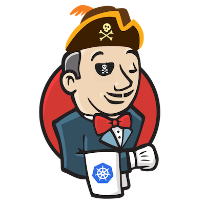

# Kubekins, Micro-Service Manager for Kubernetes

<p align="center">  </p>

> A tool to register micro-service(github projects) and then create deploy environments like staging, testing, production etc and manage these inside kubernetes cluster.

This tool will help in zero downtime deployment of the application when existing environment version is updated. It uses rolling update to change image(versions) of environment to achieve it.

Register a micros-service by adding github repository url. You have an option to choose codeship as the default built tool if you have not already registered it.Automatic hooks will be created from github to codeship if codeship user has proper access(Credentials to be provided in application's environment variables). 

After registering a micro-service, We can now create multiple environments for the same. Each environment will have a separate namespace in kubernetes. Add environment to create deployment in kubernetes. This environment can then be update in Zero Downtime to other versions.

Cluster manager is used to register the kubernetes cluster. Currently only gcp cluster is supported.
SSL certificate and key is also required , so that domain can be registered. 

# Build details

If Codeship is used then add these folders in your repository.

1. Folder name **Docker** containing Dockerfile 
2. Folder named **yaml**  containing items below
    1. Config folder containing all configmaps
    2. microservice containing deployment yaml
    3. ingress folder containing ingress.yaml
    4. service folder containing service to deploy
    5. environment-variables-list-for-user.txt
    6. environment-variables.yaml
    7. hpa.yaml
    8. pdb.yaml

The build tool will make a docker image of whatever you want to deploy.Image tag format should be vx.x.x.x Eg v1.0.1 , v2.0.1.1 etc.
Only Google cloud registry is supported. The build will push the docker image to this registry.

You can also create your own build similar to above.

# Screenshots

1. Register Cluster


2. Details Of Clusters


3. Add Micro-service


4. Add Environment


# Installation instructions

Application will run on a linux operation system having bash shell.
It should also have kubectl, helm , awsctl and gcloud installed locally.

Application uses postgres for database , rabbitmq for queueing and AWS s3 from where kubernetes configuration files will be downloaded.
So Postgres Database instance , Rabbitmq queue and S3 is required and replace appropriate values in environmnet variables.

To run the project, do the following:
1. Clone project
2. Then run `mvn clean package` to generate jar file of the project
3. Run the java jar with below environment variables

**Environment variables :**
```
MAX_DB_CONNECTION_POOL_SIZE database connection pool size
PG_PASSWORD database password
PG_USER database user
DB_NAME database name
DB_SERVER database endpoint
S3_REGION s3 bucket region
S3_SECRET_KEY 
S3_ACCESS_KEY
PORT the port where the application will listen
HOME_PATH home directory of user where every thing is installed in linux
CODESHIP_PASSWORD 
CODESHIP_USERNAME
NEW_RELIC_LICENCE_KEY
S3_CLUSTER_BUCKET s3 bucket name where TLS keys will be stored
MICROSERVICE_YAML_FOLDER_PATH folder path where application yaml folder will be downloaded
MICROSERVICE_DOMAIN_NAME domain name from where this application will be accessed.
S3_MICROSERVICE_BUCKET s3 bucket name where yaml folders are uploaded and will be downloaded from
```
